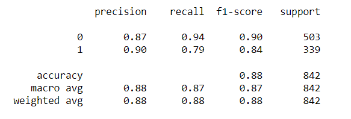
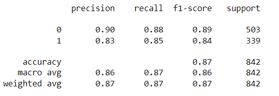

# Spambase Dataset Analysis using KNN and Decision Trees
This project aims to analyze the Spambase dataset from the UCI Machine Learning Repository using two machine learning models, K-Nearest Neighbors (KNN) and Decision Trees. The objective of the project is to classify emails as either spam or non-spam based on various features provided in the dataset.

## Dataset
The Spambase dataset contains 4601 email messages, out of which 1813 are labeled as spam. The dataset consists of 57 features including the frequency of various words, characters, and other attributes in the emails. The dataset is available on the UCI Machine Learning Repository [https://archive.ics.uci.edu/ml/datasets/spambase], and was originally contributed by Hewlett-Packard Labs.

## Preprocessing
To preprocess the dataset, the following steps were taken:
- Loaded the dataset into a pandas dataframe
- Labeled the columns of the dataframe based on the attribute names provided in the dataset documentation
- Removed any duplicate rows from the dataframe
- Processed the data to match the constraints provided in the dataset documentation
- Split the dataset into input features and target variable
- Standardized the data
- Performed PCA analysis to reduce the number of features
- Split the data into training and testing sets
- Trained KNN and Decision Trees models

## Results
We evaluated the performance of the models using the "sklearn.metrics.classification_report()" function, which provides precision, recall, F1-score, and support metrics for each class. The KNN model achieved an overall accuracy of 88%, while the Decision Trees model achieved an accuracy of 87%. Based on these results, we concluded that the KNN model performed better than the Decision Trees model for this task.

### Evaluation Results (KNN):

### Evaluation Results (Decision Trees):

## Code
The relevant code for loading the dataset, preprocessing it, splitting it into training and testing sets, training and evaluating the KNN and Decision Trees models, and printing the classification report is provided in the filtering spams.ipynb script. You can also find the Spambase dataset in the spambase.csv file.

## Technologies and Platforms

